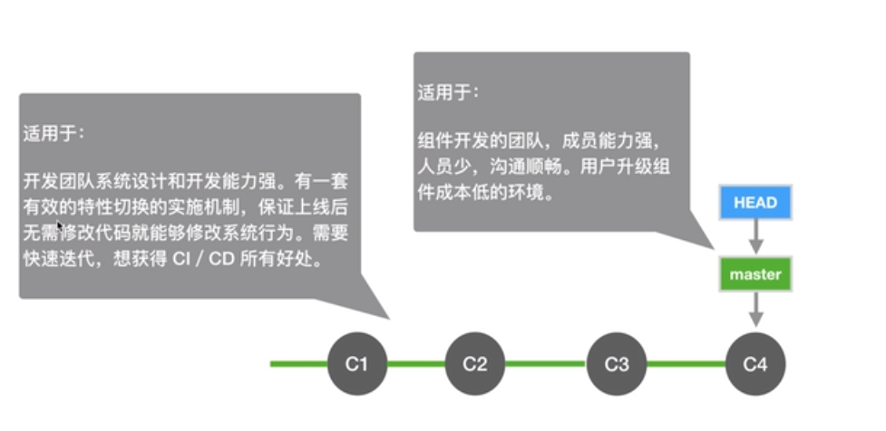

## 版本管理的演变

VCS 出现之前：
- 用目录拷贝区别不同版本
- 公共文件容易被覆盖
- 成员沟通成本很高，代码集成效率低下

集中式的 VCS：
- 有集中的版本管理服务器
- 具备文件版本管理和分支管理能力
- 集成效率有明显地提高
- 客户端必须时刻和服务器相连

分布式的 VCS：
- 服务端和客户端都有完整的版本库
- 脱离服务端，客户端照样可以管理版本
- 查看历史和版本比较等多数操作，都不需要访问服务器，比集中式 VCS 更能提高版本管理效率

Git 的特点：
- 最优的存储能力
- 非凡的性能
- 开源的
- 很容易做备份
- 支持离线操作
- 很容易定制工作流程

### 最小配置
配置 user 信息
```shell
git config --global user.name 'your_name'
git config --global user.email 'your_email'
```

#### config 的三个作用域
```shell
git config --local # 只对某个仓库有效
git config --global # 对当前用户所有仓库有效
git config --system # 对系统所有登录的用户有效
```
显示 config 的配置，加 `--list`
```shell
git config --list --local
git config --list --global
git config --list --system
```

### 建 Git 仓库
两种场景：  
1.把已有的项目代码纳入 Git 管理
```shell
git init
```
2.新建的项目直接用 Git 管理
```shell
git init your_project
```
拷贝一个文件到当前目录
```shell
cp ../test/readme .
```

`git add -u`

#### 修改文件名：
方法一：
```shell
mv readme readme.md
git add readme.md
git rm readme
```
方法二（推荐）：
```shell
git mv readme readme.md
```

清理变更(包括工作目录和暂存区)：
```shell
git reset --hard
```

查看提交历史：
```shell
git log --oneline # 简洁
git log -n4 # 查看最近的四次
git log -n4 --oneline # 组合使用
git log --all # 查看所有分支历史
git log --all --graph # 图形化
git help --web log # 在web浏览器中查看 log 的指令 
```

#### gitk 弹出图形化管理工具
```
gitk --all
```
Author 与 Committer 不同的情况。

#### 探秘 .git 目录
关注比较多的有：
- HEAD：整个仓库正在工作在哪个分支上
- config：本地配置
- refs
  - heads
  - tags
- objects：git 文件系统核心内容

`git cat-file -t ace1ed534b`查看类型  
`git cat-file -p ace1ed534b`查看内容  

文件的存储机制十分重要。  

Git 对象彼此关系：
- commit
- tree
- blob


`echo "xxxx" > xxx.ext`写信息进文件。  
`find .git/objects -type f`

#### 分离头指针情况下的注意事项
HEAD 没有指向任何指针。

#### 进一步理解 HEAD 和 branch
基于某个分支创建新分支：
```
git checkout -b fix_readme fix_css
```
HEAD 最终落脚于某个 commit。

查看两个 commit 之间的差异：
```
git diff 3d24d424 2313c2313
# or
git diff HEAD HEAD^1^1 # HEAD 父亲的父亲
git diff HEAD HEAD~2 # HEAD 父亲的父亲
```

#### 删除不想要的分支
```
git branch -d <分支名>
git branch -D <分支名>
```
查看分支：
```
git branch -v
git branch -av
```

#### 修改最新 commit 的 message
```
git commit --amend
```
查看最近一个 commit：
```
git log -1
```

#### 修改之前某个 commit 的 message
```
git rebase -i <需要修改的 commit 的父亲 commit id>
```
`-i`：指是交互式的。  
然后又编辑界面：pick 是 use commit;reword 是 use commit, but edit the commit message
以上所做操作都是在尚未提交到远程服务器的基础上。

#### 把连续的几个 commit 整理成一个
```
git rebase -i <需要修改的 commit 的父亲 commit id>
```
然后又编辑界面：pick 选一个基准 commit，然后其它的 commit 选择 squash

#### 把间隔的几个 commit 整理成一个
```
git rebase -i <需要修改的 commit 的父亲 commit id>
```
然后在交互式界面将需要合并的 commit 排列至连续的，之后 选择 squash。

#### 怎么比较暂存区和 HEAD 所含文件的差异
```
git diff --cached
```

#### 怎么比较工作区和暂存区所含文件的差异
```
git diff
```
比较具体文件：
```
git diff -- <具体文件名>
```

#### 如何让暂存区所有文件恢复成和 HEAD 一样
```
git reset HEAD
```

#### 如何让工作区的文件恢复为和暂存区一样
```
git checkout -- <file>
```

#### 怎么取消暂存区部分文件的更改
```
git reset HEAD -- <file>
```

#### 消除最近几次 commit
截止到某个commit：
```shell
git reset --hard <需要截至的commit id>
```

#### 看看不同提交的指定文件的差异
```
git diff <分支名> <另一个分支名> -- <file>
```
是比较 <另一个分支名> 相对于 <分支名> 做的修改。  

#### 正确删除文件的方法
```
git rm <file>
```

#### 开发中临时加塞了紧急任务怎么处理
```
git stash
```
取出堆栈里的信息：
```
git stash apply
# or
git stash pop
```

#### 如何指定不需要 Git 管理的文件
使用`.gitignore`文件。

#### 如何将 Git 仓库备份到本地
常用的传输协议：

哑协议与智能协议：
- 直观区别：哑协议传输进度不可见；智能协议传输可见。
- 传输速度：智能协议比哑协议传输速度快。

备份实操：
```
# --bare 不带工作区的裸仓库 哑协议
git clone --bare /Users/git_learning/.git ya.git

# 智能协议
git clone --bare file:///Users/git_learning/.git zhineng.git
```

将变更同步至远端仓库：
```
git remote -v # 查看远端仓库
git remote add <远程remote名称> file:///Users/git_learning/.git
git push --set-upstream <远程remote名称> <分支名>
```

#### 配置公私钥
先查看是否已经存在：
```shell
ls -al ~/.ssh
```
生成命令：
```shell
ssh-keygen -t rsa -b 4096 -C "your_email@example.com"
```
将公钥粘贴到 github 上。

#### 把本地仓库同步到 github
需了解 `fast-forwards` 的概念。

```shell
git remote add github git@github.com:xxxxx/xxx.git
```
将本地所有分支推送至远端：
```shell
git push github --all
```
将远端分支更新下来（不使用 pull，pull 中包含两步：拉取、合并）：
```shell
git fetch github master
```
与远端分支合并：
```shell
git merge --allow-unrelated-histories github/master
```
图形化查看历史：`gitk --all`  
缺省分支。  

#### 相同分支上不同人修改了不同文件如何处理

远端有新建分支要想在本地也创建分支需要：
```shell
git checkout -b <命名本地分支名> <要基于的远端分支名>
```

当 `fetch` 远端分支，然后再 `git branch -av` 查看时，若出现`[ahead 1, behind 1]` 的情况则做如下处理：
```shell
# 两人修改相同分支不同文件时（相同文件不同部分也可如此）
git merge 远端名/分支名
```

相同文件相同部分如何处理：
清理冲突文件后：
```
git commit -am "some message"
```
或者你想回到 merge 前的状态：
```
git merge --abort
```

#### 同时变更了文件名和文件内容如何处理
git 能智能的处理。

#### 把同一文件改成了不同文件名如何处理
用`git rm <共同修改的原文件名>`删除源文件，用`git add <需要留下的文件名>`留下协商后的文件名，用`git rm <另一个修改后的文件名>`删掉不要的文件名，最后`git commit -am"some message"`完成 merge 阶段，`git push`到远端。  

#### 禁止向集成分支执行 `push -f` 操作
#### 禁止向集成分支执行变更历史的操作

#### Github 为什么会这么火
git 诞生之前：

git诞生之后的情况:

github诞生了：

github的十年:

github成功的因素:


#### 怎么快速淘到感兴趣的开源项目
在搜索框中输入`关键字` + `in:readme`就可以在 `README.md`文件中搜索。  
`stars:>1000`代表star数大于 1000。  
案例：
- `'after_script:'+'stage:deploy' filename:.gitlan-ci.yml`
- `blog easily start in:readme stars:>5000`

#### 怎样在 Github 上搭建个人博客
借鉴 github 上的 [barryclark/jekyll-now](https://github.com/barryclark/jekyll-now)

#### 开源项目怎么保证代码质量
code review 和持续集成。

#### 为何需要组织类型的仓库

#### 怎么选择适合自己团队的工作流
需要考虑的因素：
- 团队人员的组成
- 研发设计能力
- 输出产品的特征
- 项目难易程度
主干开发：

Git Flow:

GitHub Flow

Gitlab Flow（带生产分支）:

Gitlab Flow（带环境分支）:

Gitlab Flow（带发布分支）:


靠外部的其他工具和力量，能够让基于特性分支开发的这种模型也能够持续的做集成、持续的做交付。

#### 如何挑选合适的分支集成策略
- Create a merge commit
- Squash and merge
- Rebase and merge

#### 如何启用 issue 跟踪需求和任务
提供模板编辑。

#### 如何用 projects 管理 issue

#### 项目内部怎么实施 code review
保障集成分支这块的代码质量。  
在 github 的 Settings 中选择 Branches 菜单栏

#### 多分支集成
基于 master 分支做变基：
```
git rebase origin/master
# 解决冲突文件后
git add .
git rebase --continue
```

Git 工具 - Rerere
```
git config --global rerere.enabled true
git checkout shanghai
git merge master
# 出现类似这句话：Recorded preimage for 'readme'
# 解决冲突后
git add .
git commit -am"temp"
git reset --hard HEAD~1
git rebase orign/master
git add .
git rebase --continue
```

#### 怎么包产品包发布到 Github 上
`.traivs.yml`文件。

#### 怎么给项目增加详细的指导文档。
参考：https://github.com/moby/moby.wiki.git
```
git push second master
```

#### 国内互联网企业为什么喜欢 GitLab
公司自己搭建环境。自带CI。

#### GitLab 核心功能
devops tools  
本身公司是 Jenkins 为主，gitlab ci 也很强大也可以帮我们做一部分研发过程当中的持续集成的工作。  
- Overview
- Manage
- Plan
- Create
- Verify
- Package
- Release
- Configure
- Monitor
- Secure

#### GitLab 怎么做项目管理
issue

#### GitLab 怎么做 Code review

#### GitLab 怎么保证集成质量
CI/CD  
Settings -> CI/CD -> Runners(跑CI/CD 的代理)

#### 怎么把应用部署到 AWS 上
提升编程的技能，提升运维的能力，基于这套持续集成的环境，可以减轻我们在搭建测试环境、运维环境的时间和成本，这样可以让我们编出来的东西更快的到环境当中得到验证和检查，然后反馈回来让我们更快更好的成长。  
CI/CD -> Pipelines  
保护分支：Settings -> Repository -> Protected Branches  
设置好`.gitlab-ci.yml`文件